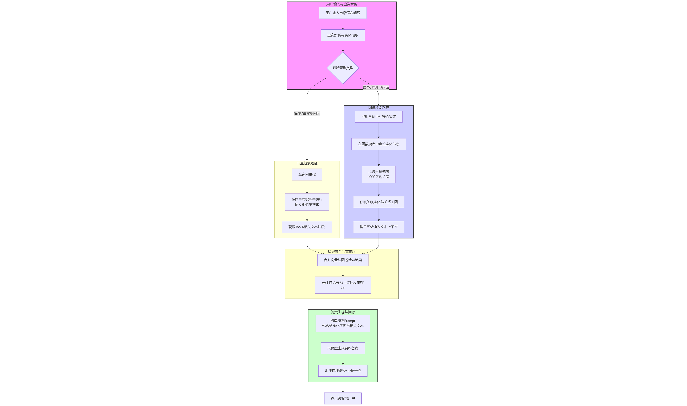

## MedGraphRAG：基于知识图谱 + RAG 的中文医疗问答系统

MedGraphRAG 是一个结合 **知识图谱 (Neo4j)**、**向量检索 (Milvus)** 和 **大语言模型 (LLM)** 的中文医疗问答系统。  
后端基于 FastAPI，前端为纯 HTML/JavaScript 聊天页面，支持可视化展示多源检索路径，适合作为 **教学 Demo** 或 **二次开发起点**。

### 系统效果展示


---

## 核心特性与技术亮点

### 🚀 多源知识融合架构

**混合检索策略**：结合结构化知识图谱与向量检索，实现精准医疗问答

- **知识图谱检索**（[Neo4j](https://neo4j.com/)）
  - 结构化实体关系：疾病–症状–药品–科室–检查等
  - NL2Cypher 自动转换：自然语言 → Cypher 查询
  - 查询验证机制：语法检查 + 语义验证
  - 置信度评估：返回查询结果的可信度分数

- **向量检索**（[Milvus](https://milvus.io/)）
  - 混合检索：稠密向量（Embedding）+ 稀疏检索（BM25）
  - RRF 重排序：Reciprocal Rank Fusion 融合多路结果
  - 大规模语料支持：病例、说明书、医学文档等非结构化数据

- **大模型生成**（[DeepSeek](https://www.deepseek.com/)）
  - 流式输出：实时展示生成过程，提升用户体验
  - 上下文融合：优先使用知识图谱结果，向量检索作为补充
  - 纯文本输出：自动清理 Markdown 格式，保证回答简洁

### 🧠 智能上下文增强系统

**基于大模型的对话理解**：自动识别指代性问题，智能补充上下文

- **指代检测**：识别"有什么"、"怎么"、"如何"等指代性词语
- **主题提取**：从对话历史中提取核心医学实体（疾病、症状、药物）
- **问题增强**：将提取的主题补充到问题中，生成完整清晰的问题
- **智能判断**：使用 DeepSeek 大模型进行语义理解，而非简单规则匹配

**示例**：
```
用户：感冒了有什么症状？
助手：感冒的常见症状包括发热、咳嗽、流鼻涕等。

用户：有什么特效药？  ← 包含指代
系统增强：感冒有什么特效药？  ← 自动补充主题
```

> 📖 详细文档：[上下文增强系统](./architecture/context_enhancement.md)

### 💬 对话历史管理系统

**Redis 驱动的会话管理**：支持多轮对话、历史记录、会话切换

- **会话管理**：
  - 自动生成唯一会话ID（UUID）
  - 每个会话最多保存10条对话记录
  - 达到上限自动创建新会话
  - 支持手动创建新会话

- **历史记录**：
  - 实时保存对话到 Redis
  - 历史会话列表展示（最多50个）
  - 点击历史记录可查看完整对话
  - 支持搜索和导出功能

- **智能标题**：
  - 创建新窗口时显示"新窗口"
  - 首次对话后自动更新为第一个问题
  - 动态更新消息数量和更新时间

> 📖 详细文档：[对话记录系统](./architecture/conversation_history_system.md)

### 🏗️ 模块化架构设计

**清晰的职责划分**：每个模块独立封装，易于维护和扩展

- **配置层**（[`config/`](../config/)）
  - 集中配置管理：环境变量 + 默认值
  - 类型安全：使用 Pydantic Settings
  - 敏感信息隔离：API Key、密码等通过环境变量配置

- **核心层**（[`core/`](../core/)）
  - **模型封装**：Embedding（ZhipuAI）、LLM（DeepSeek）
  - **向量存储**：Milvus 客户端封装，支持混合检索
  - **知识图谱**：Neo4j 客户端、图模式定义、NL2Cypher Prompt
  - **缓存系统**：Redis 客户端、对话历史管理
  - **上下文增强**：智能问题增强模块

- **服务层**（[`services/`](../services/)）
  - **Agent 服务**：整合多源检索 + LLM 生成，提供统一问答接口
  - **图服务**：NL2Cypher 生成、验证、执行，独立图服务 API
  - **流式处理**：SSE 流式输出，实时展示检索和生成过程

- **接口层**（[`api/`](../api/)）
  - FastAPI 路由与中间件
  - RESTful API 设计
  - 跨域支持（CORS）

- **展示层**（[`web/`](../web/)）
  - 纯 HTML/JavaScript，无需构建工具
  - 实时流式展示：检索路径、生成过程
  - 对话历史管理：创建、查看、搜索、导出
  - 响应式设计：支持移动端和桌面端

### ⚡ 性能优化与工程实践

**生产级工程化**：注重性能、可维护性和可扩展性

- **检索优化**：
  - 并行检索：向量检索与知识图谱查询同时进行
  - 结果融合：优先使用知识图谱的结构化结果
  - 缓存机制：Redis 缓存常用问答对

- **流式处理**：
  - Server-Sent Events (SSE) 实时推送
  - 分阶段展示：检索进度、生成过程、最终结果
  - 用户体验优化：实时反馈，减少等待焦虑

- **错误处理**：
  - 多层错误处理：API 调用失败自动回退
  - 服务降级：大模型失败时使用规则判断
  - 详细日志：记录每个环节的执行情况

- **开发体验**：
  - 一键启动：`start.sh` 脚本自动启动所有服务
  - 模块化文档：每个模块独立的 README
  - 测试支持：单元测试和集成测试框架

更细粒度的模块说明见各模块目录下的 `README.md`，以及：
- `docs/architecture/technical_workflow.md` - 技术流程说明
- `docs/architecture/conversation_history_system.md` - 对话记录系统
- `docs/architecture/context_enhancement.md` - 上下文增强系统

---

## 快速导航

- [环境准备](#环境准备) | [启动与运行](#启动与运行) | [使用方式](#使用方式) | [架构概览](#架构概览)
- [配置模块文档](../config/README.md) | [核心模块文档](../core/README.md) | [服务层文档](../services/README.md)
- [技术流程文档](./architecture/technical_workflow.md) | [对话记录系统](./architecture/conversation_history_system.md) | [上下文增强系统](./architecture/context_enhancement.md) | [版本路线图](./roadmap/v2.0_roadmap.md) | [项目根目录](../)

---

## 系统核心流程与技术架构

### 完整工作流程

下图展示了 MedGraphRAG 系统的完整工作流程，从数据准备、知识库构建到用户查询、并行检索和答案生成的五个核心步骤：



### 核心技术点

1. **数据准备与知识库构建**
   - 从原始医疗数据（medical.json、data.jsonl 等）构建 Neo4j 知识图谱
   - 文档切分、向量化后导入 Milvus 向量库
   - 支持增量更新和版本管理

2. **智能上下文增强**（核心创新）
   - 基于大模型的指代检测和主题提取
   - 自动补充对话历史中的主题实体
   - 提升指代性问题的理解准确性

3. **并行检索优化**
   - 向量检索与知识图谱查询并行执行
   - RRF 重排序融合多路检索结果
   - 查询验证确保知识图谱查询的准确性

4. **结果融合策略**
   - 知识图谱结果优先（结构化、高置信度）
   - 向量检索结果补充（非结构化、细节丰富）
   - 智能权重分配，确保答案准确性

5. **流式生成与展示**
   - SSE 实时推送检索和生成进度
   - 分阶段可视化展示，提升用户体验
   - 支持中断和错误恢复

6. **对话历史管理**
   - Redis 持久化存储对话记录
   - 自动会话管理和标题更新
   - 支持历史查看、搜索、导出

---

## 目录结构概览

```bash
MedGraphRAG/
├── requirements.txt            # 项目依赖
├── start.sh                    # 一键启动脚本（启动两大服务并自动打开浏览器）
├── api/                        # API 层（FastAPI 路由与中间件，可选入口）
├── config/                     # 配置管理（环境变量 + 默认值）
├── core/                       # 核心能力（模型 / 向量库 / 图谱 / 缓存等）
├── services/                   # 服务层（Agent 服务、图服务）
├── data/                       # 数据文件（原始 / 处理后 / 词典）
├── storage/                    # 本地数据库 / 模型 / 日志 / PID 等
├── utils/                      # 工具脚本（文档加载、文本切分等）
├── web/                        # 前端静态页面（`index.html` 医疗问答界面）
├── scripts/                    # Python 启动脚本（被 `start.sh` 调用）
├── tests/                      # 测试用例（占位）
└── docs/                       # 文档（本文件 + 技术流程）
```

---

## 环境准备

### 基础依赖

- Python 3.8+
- Neo4j 数据库（知识图谱）
- Milvus（向量数据库，当前使用本地文件存储）
- Redis（可选，用于缓存问答）
- 足够磁盘空间（本地模型权重 + 向量库 + 日志）

### 安装 Python 依赖

在项目根目录执行：

```bash
pip install -r requirements.txt
```

推荐使用虚拟环境（`venv` 或 `conda`）：

```bash
python -m venv .venv
source .venv/bin/activate        # Windows 使用 .venv\Scripts\activate
pip install -r requirements.txt
```

### 配置环境变量 / API Key

主要配置集中在 [`config/settings.py`](../config/settings.py)，支持从环境变量中读取：

- LLM 与 Embedding：
  - `DEEPSEEK_API_KEY`
  - `ZHIPU_API_KEY`
- Neo4j：
  - `NEO4J_URI`
  - `NEO4J_USER`
  - `NEO4J_PASSWORD`
- Redis（可选）：
  - `REDIS_HOST` / `REDIS_PORT` / `REDIS_PASSWORD`
- 服务端口：
  - `AGENT_SERVICE_PORT`（默认 `8103`）
  - `GRAPH_SERVICE_PORT`（默认 `8101`）

> ⚠️ 建议通过系统环境变量配置敏感信息，**不推荐** 在代码中硬编码 API Key 和密码。

> 详细配置说明请查看：`config/README.md`

---

## 启动与运行

### 方式一：一键启动（推荐）

在项目根目录执行：

```bash
chmod +x start.sh        # 第一次使用需要赋予执行权限
./start.sh
```

该脚本会：

1. 自动选择 Python 解释器（默认 `python3.11`，可通过环境变量 `PYTHON_CMD` 覆盖）  
2. 后台启动两个服务：
   - Agent 服务：[`scripts/start_agent.py`](../scripts/start_agent.py)（默认端口 `8103`）
   - 图服务：[`scripts/start_graph_service.py`](../scripts/start_graph_service.py)（默认端口 `8101`）
3. 等待端口就绪
4. 在 macOS 上自动打开浏览器访问 `http://localhost:8103/`
5. 监控服务进程，脚本退出时尝试清理子进程

日志输出默认位于：

- [`storage/logs/agent_service_simple.log`](../storage/logs/agent_service_simple.log)
- [`storage/logs/graph_service_simple.log`](../storage/logs/graph_service_simple.log)

> 启动脚本说明：`scripts/README.md` | 启动脚本源码 `start.sh`

### 方式二：手动启动（开发调试）

也可以在两个终端分别启动服务：

```bash
cd /path/to/MedGraphRAG

# 启动 Agent 服务（负责前端页面 + 医学问答接口）
python scripts/start_agent.py

# 启动图服务（负责 NL2Cypher + Neo4j 查询）
python scripts/start_graph_service.py
```

---

## 使用方式

### 前端聊天页面

启动 Agent 服务后，在浏览器访问：

```text
http://localhost:8103/
```

#### 页面展示


#### 功能特性

页面提供：

- 医学问答聊天窗口
- 示例问题按钮
- 多源检索路径可视化：
  - 向量检索（Milvus）
  - PDF 检索（ParentDocumentRetriever）
  - 知识图谱查询（Neo4j）
- 知识图谱生成的 Cypher 语句与置信度展示

前端通过：

- `API_URL = window.location.origin + '/'`
- 向当前域名根路径发起 `POST /` 请求

对应后端 `services/agent_service.py` 中的：

- `@app.get("/")`：返回 `web/index.html`
- `@app.post("/")`：接收 `{"question": "..."}`，执行多源检索 + LLM 生成回答

> 前端详细说明：`web/README.md` | 服务层说明：`services/README.md`

### 直接调用 API

医学问答接口示例：

```bash
curl -X POST "http://localhost:8103/" \
  -H "Content-Type: application/json" \
  -d '{"question": "感冒了有什么症状？"}'
```

服务信息接口示例：

```bash
curl "http://localhost:8103/api/info"
```

图服务还提供 `/generate`、`/validate`、`/execute` 等接口，详见 `services/README.md` 与 `services/graph_service.py`。

---

## 技术架构详解

### 系统架构图

```
┌─────────────────────────────────────────────────────────────┐
│                        前端层                                │
│  • HTML/JavaScript 单页应用                                   │
│  • SSE 流式展示                                              │
│  • 对话历史管理                                              │
└────────────────────┬────────────────────────────────────────┘
                     │ HTTP/SSE
                     ▼
┌─────────────────────────────────────────────────────────────┐
│                      API 服务层                               │
│  ┌────────────────────┐    ┌────────────────────┐         │
│  │  Agent Service     │    │  Graph Service     │         │
│  │  (端口: 8103)      │    │  (端口: 8101)       │         │
│  │  • 问答接口        │    │  • NL2Cypher        │         │
│  │  • 流式处理        │    │  • 查询验证         │         │
│  │  • 会话管理        │    │  • 结果执行         │         │
│  └────────────────────┘    └────────────────────┘         │
└────────────────────┬────────────────────────────────────────┘
                     │
         ┌───────────┼───────────┐
         │           │           │
         ▼           ▼           ▼
┌─────────────┐ ┌─────────────┐ ┌─────────────┐
│   Milvus    │ │    Neo4j    │ │   Redis     │
│  向量数据库  │ │  知识图谱   │ │  缓存/历史  │
└─────────────┘ └─────────────┘ └─────────────┘
         │           │           │
         └───────────┼───────────┘
                     │
                     ▼
┌─────────────────────────────────────────────────────────────┐
│                      大模型服务                              │
│  • DeepSeek API (LLM 生成)                                   │
│  • ZhipuAI API (Embedding)                                  │
└─────────────────────────────────────────────────────────────┘
```

### 核心模块详解

#### `config/` – 配置管理
- **统一配置中心**：`settings.py` 使用 Pydantic Settings
- **环境变量支持**：敏感信息通过环境变量配置
- **类型安全**：配置项类型检查和验证
- **默认值管理**：提供合理的默认配置

#### `core/` – 核心能力层

**`models/`** - 模型封装
- `embeddings.py`：ZhipuAI Embedding 封装
- `llm.py`：DeepSeek LLM 客户端封装
- 统一的模型接口，易于切换和扩展

**`vector_store/`** - 向量存储
- `milvus_client.py`：Milvus 客户端封装
- 混合检索：稠密向量 + BM25 稀疏检索
- RRF 重排序：融合多路检索结果
- 支持大规模向量数据管理

**`graph/`** - 知识图谱
- `neo4j_client.py`：Neo4j 数据库连接
- `models.py`：图模式定义（节点、关系类型）
- `prompts.py`：NL2Cypher 提示词工程
- `validators.py`：查询验证器（语法 + 语义）
- `schemas.py`：数据模式定义

**`cache/`** - 缓存系统
- `redis_client.py`：Redis 客户端封装
- 对话历史管理：保存、查询、更新
- 会话列表管理：Sorted Set 实现时间排序
- 自动过期机制：24小时对话历史，30天会话列表

**`context/`** - 上下文增强（核心创新）
- `enhancer.py`：智能问题增强模块
- 大模型驱动的指代检测和主题提取
- 自动问题补全，提升问答准确性

#### `services/` – 业务服务层

**`agent_service.py`** - Agent 服务
- 整合多源检索：向量检索 + 知识图谱查询
- 流式处理：SSE 实时推送检索和生成过程
- 上下文增强：在检索前增强用户问题
- 会话管理：创建、查询、更新会话
- 统一问答接口：`POST /` 和 `GET /`

**`graph_service.py`** - 图服务
- NL2Cypher 生成：自然语言转 Cypher 查询
- 查询验证：语法检查 + 语义验证
- 查询执行：执行 Cypher 并格式化结果
- 独立服务：可单独部署和扩展

**`streaming_handler.py`** - 流式处理
- SSE 事件流：分阶段推送检索和生成进度
- 事件类型：`search_stage`、`answer_chunk`、`query_enhanced` 等
- 错误处理：优雅降级和错误恢复

#### `web/` – 前端展示层
- **纯前端实现**：无需构建工具，直接运行
- **实时流式展示**：检索路径、生成过程可视化
- **对话历史管理**：创建、查看、搜索、导出
- **响应式设计**：适配移动端和桌面端
- **用户体验优化**：加载状态、错误提示、空状态处理

#### `scripts/` – 启动脚本
- `start_agent.py`：启动 Agent 服务
- `start_graph_service.py`：启动图服务
- `start.sh`：一键启动脚本，自动管理进程

### 技术栈总结

| 层级 | 技术选型 | 用途 |
|------|---------|------|
| **前端** | HTML5 + JavaScript (原生) | 单页应用，无需构建 |
| **后端框架** | FastAPI | 高性能异步 Web 框架 |
| **知识图谱** | Neo4j | 结构化医疗知识存储 |
| **向量数据库** | Milvus | 大规模向量检索 |
| **缓存/存储** | Redis | 对话历史、会话管理 |
| **大模型** | DeepSeek API | LLM 生成和上下文增强 |
| **Embedding** | ZhipuAI API | 文本向量化 |
| **检索算法** | RRF (Reciprocal Rank Fusion) | 多路检索结果融合 |

### 核心技术亮点

1. **混合检索架构**：结合结构化（知识图谱）和非结构化（向量检索）数据
2. **智能上下文增强**：基于大模型的指代消解和主题提取
3. **流式处理**：SSE 实时推送，提升用户体验
4. **查询验证机制**：确保知识图谱查询的准确性和安全性
5. **模块化设计**：清晰的职责划分，易于维护和扩展
6. **工程化实践**：配置管理、错误处理、日志记录、测试支持

> 📖 更详细的架构与调用链说明，见 [`docs/architecture/technical_workflow.md`](./architecture/technical_workflow.md)

---

## 技术优势与创新点

### 🎯 核心技术优势

1. **混合检索架构**
   - 知识图谱提供结构化、高置信度的答案
   - 向量检索补充非结构化、细节丰富的信息
   - RRF 融合算法优化检索结果排序

2. **智能上下文理解**
   - 基于大模型的指代消解，无需规则维护
   - 自动提取对话主题，智能补充问题上下文
   - 提升多轮对话的理解准确性

3. **流式处理体验**
   - SSE 实时推送，用户可看到检索和生成过程
   - 分阶段可视化展示，减少等待焦虑
   - 支持中断和错误恢复

4. **查询安全保障**
   - NL2Cypher 查询验证：语法检查 + 语义验证
   - 防止恶意查询和注入攻击
   - 置信度评估，确保结果可靠性

5. **工程化实践**
   - 模块化设计，职责清晰
   - 配置集中管理，环境变量支持
   - 完善的错误处理和日志记录
   - 一键启动，开箱即用

### 🚀 性能指标

- **检索速度**：并行检索，总耗时约 2-5 秒
- **生成速度**：流式输出，首字延迟 < 1 秒
- **并发支持**：FastAPI 异步框架，支持高并发
- **存储效率**：Redis 压缩存储，支持大规模历史记录

### 📈 适用场景

- **医疗问答系统**：快速构建专业的医疗问答应用
- **知识图谱应用**：展示知识图谱在问答系统中的价值
- **RAG 系统开发**：作为 RAG 系统的参考实现
- **教学演示**：适合作为教学 Demo 和二次开发起点

## 开发与扩展指南

### 快速开始

1. **环境准备**
   ```bash
   # 安装依赖
   pip install -r requirements.txt
   
   # 配置环境变量
   export DEEPSEEK_API_KEY="your_key"
   export ZHIPU_API_KEY="your_key"
   export NEO4J_URI="bolt://localhost:7687"
   ```

2. **一键启动**
   ```bash
   chmod +x start.sh
   ./start.sh
   ```

3. **访问系统**
   - 前端界面：http://localhost:8103/
   - API 文档：http://localhost:8103/docs

### 扩展开发

#### 新增数据源
1. 在 `core/` 中增加对应封装（如 `core/xxx_client.py`）
2. 在 `services/agent_service.py` 中组合调用
3. 在 `web/index.html` 中增加展示

#### 替换/新增 LLM
1. 在 `core/models/llm.py` 中封装新模型
2. 在 `config/settings.py` 中添加配置
3. 在 Agent 逻辑中切换或路由

#### 增强知识图谱
1. 在 `data/` 中准备新数据
2. 更新 `core/graph/models.py` 中的图模式
3. 更新 `core/graph/prompts.py` 中的提示词

### 最佳实践

- **依赖管理**：使用虚拟环境，避免系统 Python 冲突
- **配置管理**：优先使用环境变量，不在代码中硬编码
- **错误处理**：查看 `storage/logs/` 中的日志文件
- **代码规范**：遵循模块化设计，保持职责清晰

### 文档维护

如在使用过程中新增模块或流程，建议：

- 在对应模块目录下补充或更新 `README.md`
- 在 `docs/architecture/` 中补充技术文档
- 更新本 README 的相关章节
- 如有重大改动，可在 `CHANGELOG.md` 中记录

---

## 项目信息

- **项目名称**：MedGraphRAG
- **项目类型**：医疗问答系统 / RAG 系统
- **技术栈**：Python + FastAPI + Neo4j + Milvus + Redis + DeepSeek
- **许可证**：MIT (待定)
- **维护状态**：积极维护中

## 相关资源

- 📖 [技术流程文档](./architecture/technical_workflow.md)
- 📖 [对话记录系统](./architecture/conversation_history_system.md)
- 📖 [上下文增强系统](./architecture/context_enhancement.md)
- 📖 [版本路线图](./roadmap/v2.0_roadmap.md)
- 📦 [项目根目录](../)

---


